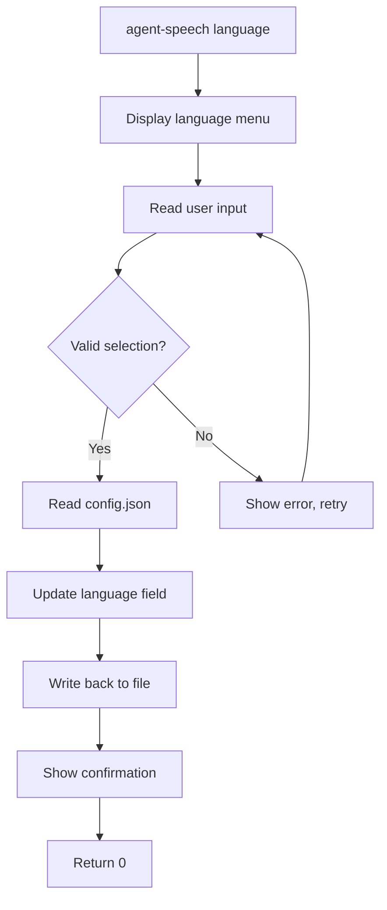
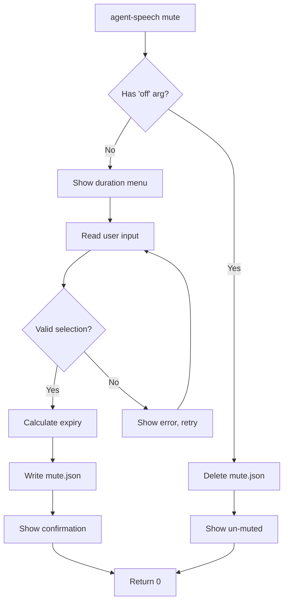

# Design: CLI Interactive Commands

**Feature**: `cli-interactive-commands`
**Date**: 2026-02-17
**Level**: Starter
**Phase**: Design

---

## Overview

Design document for implementing two interactive CLI commands: `agent-speech language` and `agent-speech mute`. These commands provide a user-friendly interface for commonly performed configuration changes that currently require manual JSON file editing.

---

## Architecture Overview

### Component Architecture

```
┌─────────────────────────────────────────────────────────────────────┐
│                           TypeScript CLI                            │
│                                                                    │
│  ┌─────────────────┐    ┌─────────────────┐    ┌─────────────────┐ │
│  │  language.ts    │    │     mute.ts      │    │   status.ts     │ │
│  │                 │    │                 │    │                 │ │
│  │ • cmdLanguage() │    │ • cmdMute()     │    │ • mute status   │ │
│  │ • readline UI   │    │ • duration menu  │    │ • time calc     │ │
│  │ • JSON patching │    │ • timestamp mgmt│    │ • countdown     │ │
│  └─────────────────┘    └─────────────────┘    └─────────────────┘ │
│           │                     │                     │           │
│           └─────────┬───────────┴─────────┬───────────┘           │
│                       │                     │                       │
│           ┌─────────────────────────────────────────────────────┐ │
│           │                   cli.ts                           │ │
│           │ • Command registration                             │ │
│           │ • Argument validation                              │ │
│           │ • Error handling                                    │ │
│           └─────────────────────────────────────────────────────┘ │
└─────────────────────────────────────────────────────────────────────┘
                                                                   ↓
┌─────────────────────────────────────────────────────────────────────┐
│                         Bash Hooks System                          │
│                                                                    │
│  ┌─────────────────┐    ┌─────────────────┐    ┌─────────────────┐ │
│  │ load-config.sh  │    │   All Hooks     │    │   mute.json     │ │
│  │                 │    │                 │    │                 │ │
│  │ • IS_MUTED var  │    │ • Guard clause  │    │ • until: ts     │ │
│  │ • expiry check   │    │ • exit 0 if    │    │ • duration: str │ │
│  │ • auto-cleanup  │    │   muted         │    │                 │ │
│  └─────────────────┘    └─────────────────┘    └─────────────────┘ │
└─────────────────────────────────────────────────────────────────────┘
```

---

## Detailed Design

### 1. Language Command (`src/commands/language.ts`)

#### Interface Design
```typescript
/**
 * Interactive language selection command
 * @returns Exit code (0 = success)
 */
export async function cmdLanguage(): Promise<number> {
  // Implementation below
}
```

#### User Flow


#### Interactive Menu
```
Available languages:
  1. English (en)
  2. Korean (ko)
  3. Japanese (ja)
  4. Chinese (zh)
  5. Spanish (es)
  6. French (fr)
  7. German (de)
  8. Italian (it)
Enter number [1-8]:
```

#### JSON Schema Considerations
**Critical**: Maintain compatibility between TypeScript CLI nested schema and bash hooks flat schema.

**Strategy**: Patch only the `language` key at the top level:
```typescript
// Before (TypeScript CLI format)
{
  "version": "1.0.0",
  "global": { "voice": "Samantha" },
  "tools": { "claude-code": { "enabled": true } }
}

// After (language patch)
{
  "version": "1.0.0",
  "global": { "voice": "Samantha" },
  "tools": { "claude-code": { "enabled": true } },
  "language": "ko"  // ← Added at top level
}
```

#### Implementation Details
- **File Operations**: Use `fs.readFileSync` + `fs.writeFileSync` for atomic writes
- **Validation**: Check against SUPPORTED_LANGUAGES array
- **Feedback**: Show current language before selection
- **Error Handling**: Graceful failure on file permission errors

### 2. Mute Command (`src/commands/mute.ts`)

#### Interface Design
```typescript
/**
 * Mute TTS for duration or cancel mute
 * @param arg Optional 'off' to cancel mute
 * @returns Exit code (0 = success)
 */
export async function cmdMute(arg?: string): Promise<number> {
  // Implementation below
}
```

#### Command Variants
```bash
# Show duration menu
agent-speech mute

# Cancel mute
agent-speech mute off
```

#### User Flow (Interactive)


#### Duration Menu
```
Select mute duration:
  1. 5 minutes
  2. 10 minutes
  3. 15 minutes
  4. 30 minutes
  5. 1 hour
  6. 2 hours
  7. Permanent
Enter number [1-7]:
```

#### Mute State File (`~/.agent-speech/mute.json`)
```json
{
  "until": "2026-02-17T10:35:00.000Z",
  "duration": "5min"
}
```

**Fields**:
- `until`: ISO timestamp (RFC 3339) or `null` for permanent
- `duration`: Human-readable string for display

### 3. Status Command Enhancement

#### Extended Status Display
Modify `src/commands/status.ts` to show mute status:

```typescript
// Add to status output
format('Mute status:');
if (isMuted) {
  const remaining = getRemainingMuteTime();
  if (remaining === 'permanent') {
    formatListItem('muted: permanent', false);
  } else {
    formatListItem(`muted: ${remaining}`, false);
  }
} else {
  formatListItem('muted: off', true);
}
```

#### Mute Time Calculation
```typescript
/**
 * Calculate remaining mute time
 * @returns Formatted string or 'permanent'
 */
function getRemainingMuteTime(): string {
  // Implementation using mute.json
}
```

### 4. Bash Hook Integration

#### Enhanced `load-config.sh`

```bash
# Add after existing config loading
MUTE_FILE="$HOME/.agent-speech/mute.json"
IS_MUTED=false

if [[ -f "$MUTE_FILE" ]]; then
  UNTIL=$(jq -r '.until // empty' "$MUTE_FILE" 2>/dev/null || echo "")

  if [[ -z "$UNTIL" ]]; then
    IS_MUTED=true  # permanent mute
  else
    # BSD date command on macOS
    NOW=$(date -u +%s)
    UNTIL_EPOCH=$(date -u -jf "%Y-%m-%dT%H:%M:%S" "${UNTIL%.*}" +%s 2>/dev/null || echo 0)

    if [[ $NOW -lt $UNTIL_EPOCH ]]; then
      IS_MUTED=true
    else
      # Auto-cleanup expired mute
      rm -f "$MUTE_FILE"
    fi
  fi
fi

export IS_MUTED
```

#### Hook Guard Pattern
Add to all 5 hook scripts:
```bash
# Skip TTS if muted
if [[ "$IS_MUTED" == "true" ]]; then
  exit 0
fi
```

---

## Data Models

### Supported Languages
```typescript
const SUPPORTED_LANGUAGES = [
  { code: 'en', name: 'English' },
  { code: 'ko', name: 'Korean' },
  { code: 'ja', name: 'Japanese' },
  { code: 'zh', name: 'Chinese (Simplified)' },
  { code: 'es', name: 'Spanish' },
  { code: 'fr', name: 'French' },
  { code: 'de', name: 'German' },
  { code: 'it', name: 'Italian' },
] as const;
```

### Duration Mapping
```typescript
const DURATION_OPTIONS = [
  { value: 1, label: '5 minutes', ms: 300000 },
  { value: 2, label: '10 minutes', ms: 600000 },
  { value: 3, label: '15 minutes', ms: 900000 },
  { value: 4, label: '30 minutes', ms: 1800000 },
  { value: 5, label: '1 hour', ms: 3600000 },
  { value: 6, label: '2 hours', ms: 7200000 },
  { value: 7, label: 'Permanent', ms: null },
] as const;
```

---

## File Structure Changes

### New Files
```
src/
└── commands/
    ├── language.ts          # New interactive language command
    └── mute.ts             # New interactive mute command
```

### Modified Files
```
src/
├── commands/
│   └── index.ts           # Export cmdLanguage, cmdMute
└── cli.ts                 # Add language/mute cases to switch

src/commands/
└── status.ts              # Add mute status display

.claude-plugin/
└── agent-speech-claude-code/
    └── hooks/
        └── load-config.sh # Add IS_MUTED export and mute logic
```

### Plugin Cache Sync
After implementation, sync updated hooks to:
```
~/.claude/plugins/cache/welico/agent-speech-claude-code/0.1.0/.claude-plugin/
```

---

## Implementation Guidelines

### Error Handling Patterns
```typescript
// File operation with error handling
try {
  const config = JSON.parse(fs.readFileSync(CONFIG_PATH, 'utf-8'));
  // ... update config ...
  fs.writeFileSync(CONFIG_PATH, JSON.stringify(config, null, 2) + '\n');
} catch (error) {
  if (error.code === 'ENOENT') {
    formatError('Configuration not found. Run "agent-speech init" first.');
  } else if (error.code === 'EACCES') {
    formatError('Permission denied. Cannot modify configuration.');
  } else {
    formatError('Error:', error.message);
  }
  return 1;
}
```

### Readline Pattern
```typescript
import readline from 'readline';

const rl = readline.createInterface({
  input: process.stdin,
  output: process.stdout,
});

function askQuestion(question: string): Promise<string> {
  return new Promise((resolve) => {
    rl.question(question, (answer) => {
      rl.close();
      resolve(answer);
    });
  });
}
```

### Date/Time Handling
```typescript
// Calculate expiry timestamp
function calculateExpiry(durationMs: number | null): string | null {
  if (durationMs === null) return null; // permanent

  const expiry = new Date(Date.now() + durationMs);
  return expiry.toISOString();
}

// Parse from mute.json
function parseMuteState(): { until: string | null; duration: string } {
  // Implementation
}
```

---

## Testing Strategy

### Unit Tests
- **Language Command**: Test invalid selections, file I/O errors, successful updates
- **Mute Command**: Test duration calculations, expiry parsing, auto-cleanup
- **Status Command**: Test mute status display, remaining time calculation

### Integration Tests
- **End-to-End**: Test actual CLI commands with real file system
- **Hook Integration**: Verify hooks respect mute state
- **Plugin Cache**: Verify hook sync after changes

### Edge Cases
- Missing config.json file
- Permission denied on config.json
- Corrupt mute.json file
- System date changes during mute period
- Ctrl+C during interactive prompts

---

## Performance Considerations

### File Operations
- **Atomic Writes**: Write to temp file then rename for atomicity
- **Caching**: Cache config in memory during session
- **Minimize I/O**: Only read/write when necessary

### Memory Usage
- **Small Footprint**: Commands are lightweight with minimal state
- **Cleanup**: Properly close readline interfaces
- **No Global State**: Each command operates independently

---

## Security Considerations

### File Permissions
- **Validate Paths**: Ensure config paths are within user's home directory
- **Safe File Operations**: Use proper error handling for file operations
- **No Symbolic Links**: Follow real paths, not symlinks

### Input Validation
- **Sanitize Inputs**: Validate all user inputs before processing
- **Bounds Checking**: Ensure numeric inputs are within valid ranges
- **Format Validation**: Validate JSON format before parsing

### Code Injection Prevention
- **No eval()**: Use proper JSON parsing
- **Command Separation**: Keep shell commands separate from user data
- **Path Safety**: Prevent directory traversal attacks

---

## Dependencies

### Node.js Built-ins
- `fs`: File system operations
- `path`: Path manipulation
- `readline`: Interactive prompts
- `process`: Exit codes and signals

### External Dependencies
- **None**: Using only Node.js built-ins to maintain lightweight footprint

---

## Migration Path

### Backward Compatibility
- **Existing Config**: Preserves all existing configuration fields
- **Language Field**: Added as optional field (defaults to 'en')
- **Mute State**: New feature with no impact on existing functionality

### Upgrade Process
1. **Plugin Sync**: Updated hooks automatically sync on plugin reload
2. **Config Migration**: Existing users get default language 'en'
3. **Zero Downtime**: Commands can be added without breaking existing ones

---

## Monitoring and Debugging

### Logging
- **Command Success/Failure**: Log important state changes
- **File Operations**: Log read/write operations for debugging
- **Error Details**: Include stack traces for unexpected errors

### Debug Flags
- **Verbose Mode**: Add `--verbose` flag for detailed operation logging
- **Dry Run**: Option to preview changes without applying them
- **Config Validation**: Validate configuration integrity after changes

---

## Future Extensions

### Enhancements
- **Per-Tool Mute**: Mute specific CLI tools while keeping others active
- **Schedule Mute**: Set mute for specific time periods
- **Voice Selection**: Interactive voice selection with preview
- **Configuration Profiles**: Save/load multiple configuration sets

### Integration Points
- **CLI Tool Integration**: Support for more CLI tools
- **GUI Interface**: Desktop app for configuration management
- **Web Interface**: Web-based configuration portal
- **API Endpoints**: REST API for programmatic access