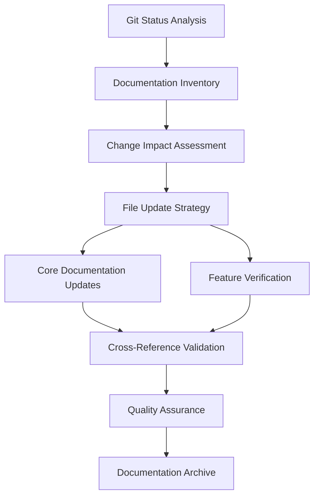
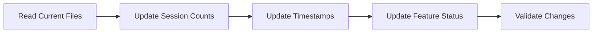
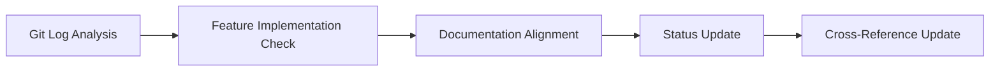
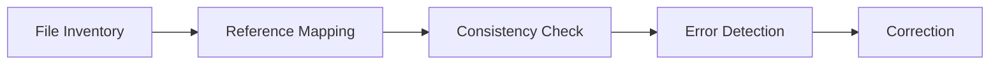
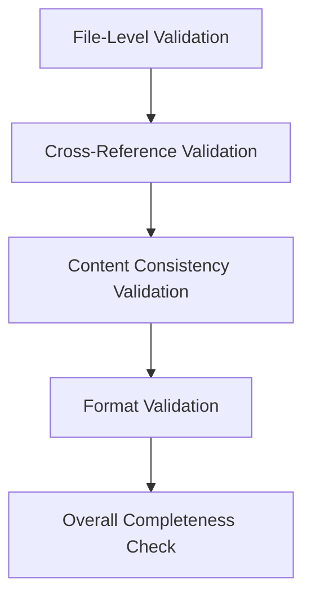

# Design: Git Changes Documentation Synchronization Implementation

## Design Overview
This design document outlines the technical implementation strategy for updating all documentation files based on current Git changes, ensuring consistency, accuracy, and maintainability.

## Architecture Overview



## Detailed Implementation Design

### 1. File-Level Specifications

#### 1.1 CLAUDE.md Updates
**Target File**: `/Users/warezio/Git/GitHub/welico/agent-speech-claude-code/CLAUDE.md`

**Required Changes**:
```markdown
# Session Statistics Update
- Change: "sessionCount": 12 → "sessionCount": 15
- Update: "lastSession" timestamp to "2026-02-16T17:05:42.597Z"
- Add: "marketplace distribution" feature status in success criteria
```

**Implementation Approach**:
```typescript
// Pattern matching for session count
const sessionPattern = /"sessionCount":\s*\d+/;
const replacement = '"sessionCount": 15';

// Pattern matching for timestamp
const timestampPattern = /"startedAt":\s*"[^"]+"/;
const replacement = '"startedAt": "2026-02-16T17:05:42.597Z"';
```

#### 1.2 .bkit-memory.json Updates
**Target File**: `/Users/warezio/Git/GitHub/welico/agent-speech-claude-code/docs/.bkit-memory.json`

**Validation Requirements**:
- Verify data structure integrity
- Ensure timestamp consistency across documents
- Check for duplicate or conflicting entries

**Schema Validation**:
```json
{
  "version": "1.4.7",
  "project": "agent-speech-claude-code",
  "sessionCount": 15,
  "lastSession": {
    "startedAt": "2026-02-16T17:05:42.597Z",
    "platform": "claude",
    "level": "Dynamic"
  }
}
```

#### 1.3 Product Requirements Documentation (prd.md)
**Target File**: `/Users/warezio/Git/GitHub/welico/agent-speech-claude-code/.claude/docs/prd.md`

**Update Requirements**:
- Verify marketplace distribution feature implementation
- Update feature status from "planned" to "implemented"
- Update timeline and completion metrics

#### 1.4 Agent Specialist Documentation
**Target Files**: `.claude/agents/*.md`

**Update Requirements**:
- Verify agent capabilities align with current implementation
- Update any references to deprecated features
- Ensure documentation matches current API/feature set

### 2. Data Mapping Strategy

#### 2.1 Session Count Mapping
```markdown
# Mapping Pattern
Source: "sessionCount": 12
Target: "sessionCount": 15
Context: All documentation files mentioning session counts
Validation: Count should match exactly across all documents
```

#### 2.2 Timestamp Mapping
```markdown
# Mapping Pattern
Source: "2026-02-16T02:15:31.261Z"
Target: "2026-02-16T17:05:42.597Z"
Context: Last session tracking
Validation: Ensure chronological consistency
```

#### 2.3 Feature Status Mapping
```markdown
# Feature Status Updates
- "marketplace distribution": "planned" → "implemented"
- "readme-usage-docs": "in-progress" → "archived"
- "documentation sync": "not-started" → "in-progress"
```

### 3. Cross-Reference Architecture

#### 3.1 Internal Reference Mapping
```markdown
# Reference Network
CLAUDE.md ↔ .bkit-memory.json
CLAUDE.md ↔ prd.md
CLAUDE.md ↔ .claude/agents/*.md
prd.md ↔ archived documentation
```

#### 3.2 Reference Validation Rules
1. **Bidirectional References**: All references must be mutual
2. **Date Consistency**: All timestamps must be chronologically consistent
3. **Feature Status**: All mentions of feature status must match
4. **Session Counts**: All session count references must be identical

### 4. Implementation Workflow

#### 4.1 Phase 1: Core Documentation Updates


**File Processing Order**:
1. `CLAUDE.md` - Primary project documentation
2. `docs/.bkit-memory.json` - Session tracking
3. `.claude/docs/prd.md` - Product requirements
4. `.claude/agents/*.md` - Agent documentation

#### 4.2 Phase 2: Feature Verification


**Verification Process**:
1. Check commit 20ca261 for marketplace distribution implementation
2. Verify feature matches documentation
3. Update status in all relevant files
4. Update cross-references

#### 4.3 Phase 3: Consistency Validation


**Validation Tools**:
- Regular expression pattern matching
- Cross-reference validation
- Data consistency checking

### 5. Error Handling Strategy

#### 5.1 Common Error Scenarios
1. **Missing References**: Documentation mentions files that don't exist
2. **Inconsistent Data**: Different session counts across documents
3. **Broken Links**: References to archived documentation
4. **Format Errors**: Markdown syntax issues

#### 5.2 Error Resolution Patterns
```typescript
// Error Detection Pattern
const errors = {
  missingReferences: [],
  inconsistentData: [],
  brokenLinks: [],
  formatErrors: []
};

// Resolution Strategy
const resolveErrors = {
  missingReferences: createMissingFiles(),
  inconsistentData: harmonizeData(),
  brokenLinks: updateReferences(),
  formatErrors: fixFormatting()
};
```

### 6. Quality Assurance Architecture

#### 6.1 Validation Layers


#### 6.2 Quality Metrics
1. **Accuracy**: All information matches Git repository state
2. **Consistency**: All documents have consistent information
3. **Completeness**: All changes are documented
4. **Accessibility**: All references are valid and accessible

### 7. Implementation Specifications

#### 7.1 File Processing Rules
1. **Atomic Updates**: Each file should be updated in a single operation
2. **Backup Strategy**: Create backups before making changes
3. **Validation**: Each change must be validated immediately
4. **Rollback**: Ability to revert changes if errors occur

#### 7.2 Update Priority Matrix
| Priority | File Type | Update Reason |
|----------|-----------|---------------|
| Critical | Session tracking data | High impact on documentation credibility |
| High | Project instructions (CLAUDE.md) | Primary documentation |
| Medium | Feature documentation | Implementation verification |
| Low | Agent specifications | Capability alignment |

#### 7.3 Performance Considerations
- **File Size**: Large files should be processed in chunks
- **Memory Usage**: Keep file contents in memory for validation
- **Processing Time**: Parallel processing where possible
- **Network Dependencies**: Minimize external dependencies

### 8. Documentation Archive Strategy

#### 8.1 Archive Structure
```
docs/archive/YYYY-MM/
├── documentation-sync-timestamp/
│   ├── before-updates/
│   ├── after-updates/
│   └── change-log.md
└── _INDEX.md
```

#### 8.2 Change Tracking
```markdown
# Change Log
## Version 1.0.0 (2026-02-16)
- Updated session count from 12 to 15
- Updated last session timestamp
- Verified marketplace distribution implementation
- Updated feature status across all documents
```

### 9. Testing Strategy

#### 9.1 Unit Tests
- File update validation
- Data consistency checks
- Reference integrity verification
- Format validation

#### 9.2 Integration Tests
- Cross-reference validation
- Archive accessibility verification
- Documentation navigation testing
- User experience validation

## Implementation Tools and Technologies

### Required Tools
- **Text Processing**: Regular expressions, template matching
- **File System**: File reading/writing, backup creation
- **Validation**: Schema validation, consistency checking
- **Documentation**: Markdown processing, link validation

### Technology Stack
- **Language**: TypeScript/JavaScript
- **File Processing**: Node.js fs module
- **Pattern Matching**: Regular expressions
- **Validation**: JSON Schema, Markdown linting

## Risk Assessment and Mitigation

### Risk 1: Data Inconsistency
**Probability**: Medium
**Impact**: High
**Mitigation**: Automated validation with multiple checks

### Risk 2: Missing Updates
**Probability**: Low
**Impact**: Medium
**Mitigation**: Comprehensive file inventory and checklist

### Risk 3: Archive Corruption
**Probability**: Low
**Impact**: High
**Mitigation**: Backup strategy and validation tests

## Success Criteria

### Technical Success
- [ ] All files updated according to specifications
- [ ] No data loss or corruption
- [ ] All cross-references valid
- [ ] Archive integrity maintained

### Quality Success
- [ ] Documentation consistency achieved
- [ ] User experience improved
- [ ] Future maintenance enabled
- [ ] Change history preserved

### Timeline
- Phase 1: Core updates (30 minutes)
- Phase 2: Feature verification (30 minutes)
- Phase 3: Consistency validation (20 minutes)
- Phase 4: Quality assurance (20 minutes)
- **Total**: 2 hours

---

**Design Status**: Complete
**Implementation Ready**: Yes
**Dependencies**: Git repository access, file system permissions
**Risk Level**: Low
**Quality Assurance**: Built into design